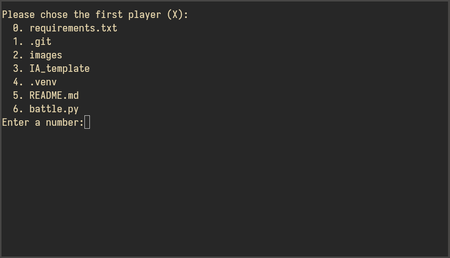
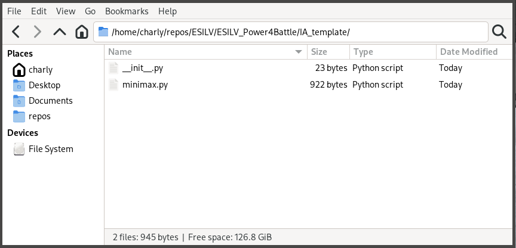

# Automatic battle

Code to automate the battle between different IA.

## Usage

You only need `numpy`.
Then run `python battle.py` in a console inside the `ESILV_Power4Battle` directory.

It should look like this:



Then you can enter the number corresponding to your directory. (You can enter the same number twice to make your AI battle itself)

## Format

Your code should follow the same format as in [`IA_template`](https://github.com/charlyalizadeh/ESILV_Power4Battle/tree/master/IA_template).



If you want to test that your IA is working with this code clone this directory and copy your code inside a directory with
the name of your group. Inside this directory you must have a file called `minimax.py` and another called `__init__.py`.

```
.
├── battle.py
├── *YOUR CODE DIRECTORY*
│   ├── __init__.py
│   └── minimax.py
└── README.md
```


`minimax.py` must contains the following functions:

* `def init()`: a function to do everything you need before the start of the battle
* `def minimax_play()`: play a move with the current board situation and return the action played (you must use a global variable for the board)
* `def opponent_play(action)`: apply the opponent move to your board

`action` must the coordinate of the column you played (between 0 and 11)

If you did everything right you can just copy and paste the template of `__init__.py` inside your code directory.

!! YOU CAN HAVE AS MANY FILES AS YOU WANT INSIDE YOUR DIRECTORY !! You just have to have `__init__.py` and `minimax.py` but you are not limited to only two files.  

If your code doesn't comply with this format your grade will be divided by 2.

If you have any question please send a mail to: charly.alizadeh@ext.devinci.fr

Good Luck!

## Common error

* `AttributeError: module 'YOUR DIRECTORY' has no attribute 'minimax'`: You must copy `__init__.py` inside your directory and have a `minimax.py` file
* `AttributeError: module 'YOUR DIRECTORY.minimax' has no attribute 'init'` (or `minimax_play` or `opponent_play`): You must have the function `init`, `minimax_play` and `opponent_play` inside the `minimax.py` file
